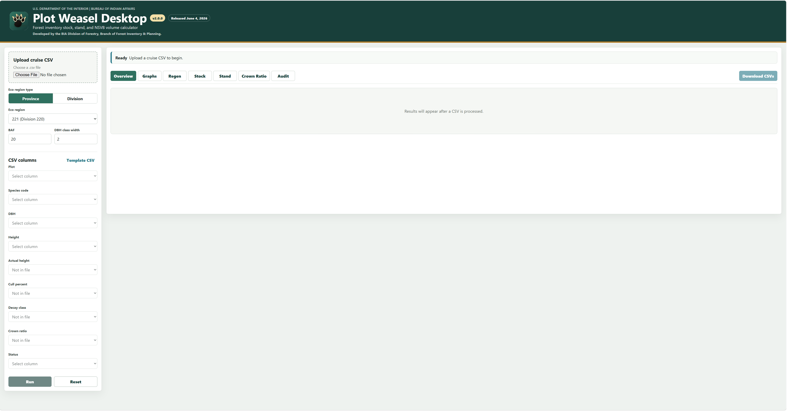
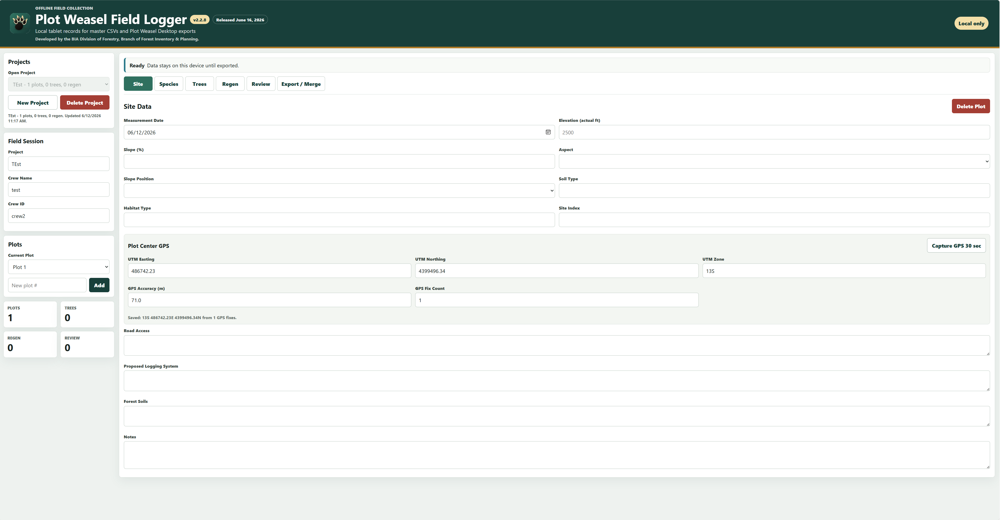
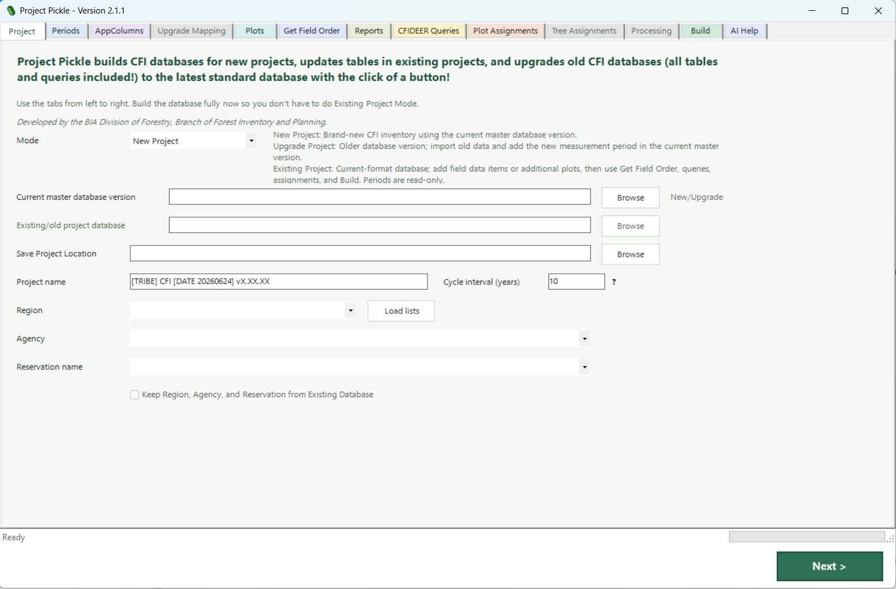

----------------------------------------------------
Chris LaCroix

Forester | AI Workflow Developer | GIS Professional

13+ years modernizing forestry operations with AI,
automation, GIS, and custom software.

[LinkedIn] [Email]
----------------------------------------------------

Featured Projects

📷 Screenshot

Plot Weasel
Offline forestry platform

--------------------------------------------

📷 Screenshot

--------------------------------------------

📷 Screenshot

--------------------------------------------

Skills

AI • GIS • Forestry • Azure OpenAI • PowerShell • JavaScript
